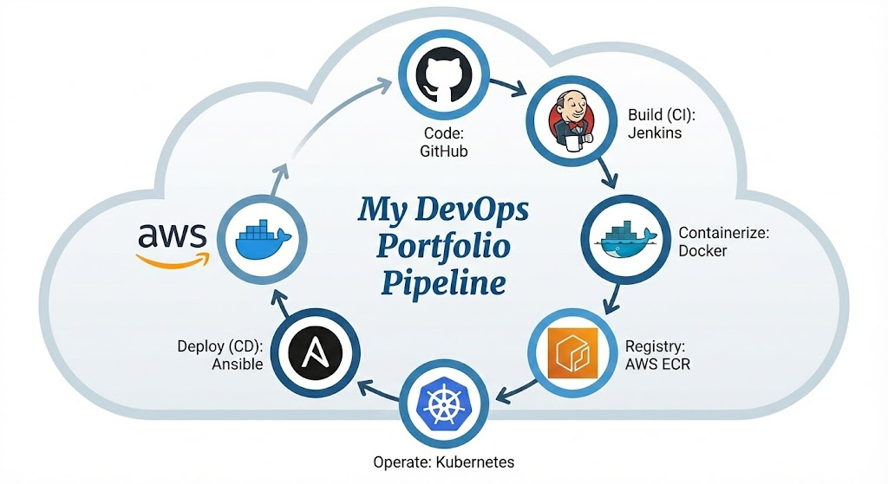

# Portfolio V2

A modern, responsive developer portfolio built with React, Vite, and Tailwind CSS. It features a terminal-inspired aesthetic with neon accents and includes sections for projects, skills, certifications, and education.

## 🚀 Project Overview: Full-Stack & Enterprise Cloud Architecture

This project is a dual-perspective demonstration of end-to-end software delivery, combining modern web development with enterprise-grade DevOps practices.

### 🏗️ Architecture Highlights



- **Enterprise Infrastructure Design**: Designed a comprehensive CI/CD pipeline using **Jenkins**, **Ansible**, and **Kubernetes (EKS)** on AWS to handle high-traffic simulation and container orchestration.
- **Production Strategy (FinOps)**: Strategically deployed the live version on **Vercel Edge Network**, prioritizing zero-cost infrastructure without compromising on global performance and SSL security.
- **Full-Stack Engineering**: Developed a reactive, terminal-themed UI using **React 19** & **Vite**, packaged via **Docker** multi-stage builds to ensure environment consistency.

## 🚀 Features

- **Responsive Design**: Fully responsive layout for all devices.
- **Terminal Aesthetic**: Dark mode with neon green/pink accents and monospace fonts.
- **Interactive Elements**: Framer Motion animations and hover effects.
- **Email Contact Form**: Functional contact form using Resend (works locally and on Vercel).
- **Docker Support**: Containerized for easy deployment.

## 🛠️ Tech Stack

- **Frontend**: React 19, Vite, Tailwind CSS v4
- **Animations**: Framer Motion, React Type Animation, React Tag Sphere
- **Backend (Local)**: Node.js, Express
- **Backend (Production)**: Vercel Serverless Functions
- **Email Service**: Resend

## 📦 Installation & Local Development

1.  **Clone the repository:**
    ```bash
    git clone https://github.com/yourusername/portfolioV2.git
    cd portfolioV2
    ```

2.  **Install dependencies:**
    ```bash
    npm install
    ```

3.  **Set up Environment Variables:**
    Create a `.env` file in the root directory and add your Resend API key:
    ```env
    RESEND_API_KEY=re_123456789
    ```

4.  **Run the Development Server:**
    ```bash
    # Terminal 1: Start the Frontend
    npm run dev

    # Terminal 2: Start the Backend Server (for local email sending)
    npm run start:server
    ```
    Access the app at `http://localhost:5173`.

## 🐳 Docker

Build and run the application using Docker:

1.  **Build the Image:**
    ```bash
    docker build -t my-portfolio:v1 .
    ```

2.  **Run the Container:**
    ```bash
    docker run -d -p 3000:80 --name my-website my-portfolio:v1
    ```
    Access the app at `http://localhost:3000`.

## ☁️ Deployment (Vercel)

This project is optimized for deployment on Vercel.

1.  Push your code to a GitHub repository.
2.  Import the project into Vercel.
3.  **Environment Variables**: Go to Project Settings > Environment Variables and add:
    - `RESEND_API_KEY`: Your Resend API key.
4.  Deploy!

The email functionality uses Vercel Serverless Functions (`api/send-email.js`), so no separate backend server is required.

## 📂 Project Structure

- `src/`: React source code
  - `components/`: Reusable UI components (Navbar, Footer, etc.)
  - `sections/`: Main page sections (Hero, About, Projects, etc.)
  - `data/`: Static data files (projects, skills, education)
  - `assets/`: Images and static assets
- `server/`: Express server for local development
- `api/`: Vercel Serverless Functions
- `public/`: Static files (favicon, etc.)

## 📄 License

MIT License
